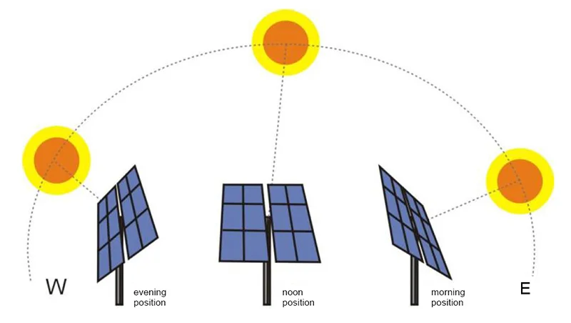
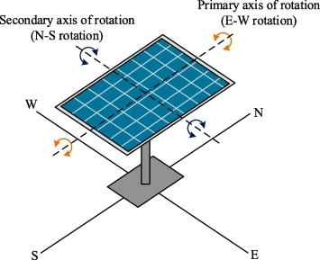
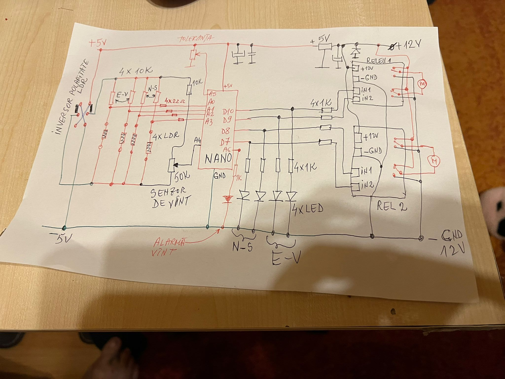

# Sun tracking solar panel (Dual axis)

This dual-axis solar tracking project using an Arduino is designed to automatically adjust the orientation of solar panels to maximize their exposure to sunlight throughout the day, thereby increasing their efficiency. This system is more efficient than the single-axis system.

Using 4 light-dependent resistors (LDR) to detect light intensity, the microcontroller will compare the amount of light that is hitting the top and bottom of the solar panel rotating rotating it on the primary axis towards the light. The same happens for the left and right-hand sides of the panel and rotating it on the secondary axis.

The tolerance between the sensor pairs can be adjusted by a variable resistor to prevent the solar panel adjusting to face the sun to frequently.

---

 

